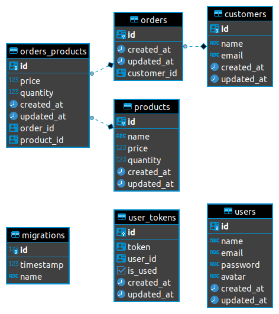

# Vendas

Essa é uma api de vendas simples, com cadastro e sistema de autenticação.

### Tecnologias utilizadas

- [Typeorm](https://typeorm.io/#/)
- [jsonwebtoken](https://jwt.io/)
- [Express](http://expressjs.com/)
- [Multer](https://www.npmjs.com/package/multer)
- [Nodemailer](https://www.npmjs.com/package/nodemailer)
- [redis](https://redis.io/)
- [Rate Limiter Flexible](https://www.npmjs.com/package/rate-limiter-flexible)

### Usando a api

1. Primeiramente faça o clone do repositório para a sua máquina

```
git clone git@github.com:abelsouzacosta/vendas.git

cd vendas
```

2. Insale as dependências

```
# instalando as dependências
yarn or npm install
```

3. Usando as variáveis de ambiente

A api faz uso de variáveis de ambiente, essas variáveis são definidas em dois arquivos distintos `.env` onde são guardadas as variáveis de ambiente referentes ao servidor e `ormconfig.env` que guarda as variáveis de ambiente referentes ao banco de dados da aplicação, assim sendo renomeie os arquivos `.env.example` e `ormconfig.env.example` para `.env` e `ormconfig.env` respectivamente

Dentro do seu `.env` determine a porta da aplicação e o hash do jwt

```
# Porta do servidor da aplicação
PORT =

# Hash do JWT
SECRET =

# HOST do redis
REDIS_HOST =

# PORT do redis
REDIS_PORT = 6379

# Senha do redis
REDIS_PASS =
```

Dentro de seu `ormconfig.env` devem estar as seguintes configurações

```
# Tipo de banco de dados utilizado
TYPEORM_CONNECTION = (postgres, mysql, sqlite...)

# Host do banco de dados
TYPEORM_HOST =

# Username do banco de dados
TYPEORM_USERNAME =

# Senha do banco
TYPEORM_PASSWORD =

# Nome do banco
TYPEORM_DATABASE =

# Porta do banco de dados
TYPEORM_PORT =

### As variáveis abaixo não devem ser modificadas ###

# Padrão das migrations
TYPEORM_MIGRATIONS = ./src/shared/infra/typeorm/migrations/*.ts

# Diretório onde devem ser criadas as migrations com o comando `typeorm migration:create`
TYPEORM_MIGRATIONS_DIR = ./src/shared/infra/typeorm/migrations

# Diretórios onde serão encontradas as entidades
TYPEORM_ENTITIES = ./src/modules/**/infra/typeorm/entities/*.ts
```

4. Crie as tabelas no banco de dados

Execute as migrations

```
yarn typeorm migration:run
```

### Banco de dados

O banco de dados dessa aplicação está disposto como no diagrama abaixo:

<h3 align="center">
  
<h3>

#### Endpoints

Você pode baixar o ambiente de rotas dessa api clicando no botão abaixo:

[](https://insomnia.rest/run/?label=Vendas&uri=https%3A%2F%2Fraw.githubusercontent.com%2Fabelsouzacosta%2Flibrary-content%2Fmaster%2Fapi_vendas.json%3Ftoken%3DAHJQ6XDYBKFUD6KX65NZ63LAQSSJG)
